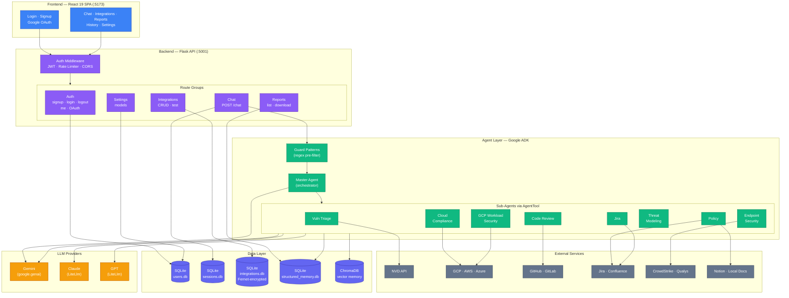

# Security Mind: AI-Powered Security Posture Management (ASPM) Platform

[](LICENSE)
[](https://www.python.org/)
[](https://react.dev/)
[](https://github.com/jitendar-singh/securitymind/actions/workflows/tests.yml)
[](https://github.com/jitendar-singh/securitymind/security)

Security Mind is a multi-agent AI platform for application security posture management. Built on the [Google ADK](https://google.github.io/adk-docs/) (Agent Development Kit), it uses an orchestrator pattern where a master agent delegates natural-language requests to 8 specialized sub-agents. A React SPA provides the user interface for chat, integration management, reports, and per-agent model selection. The system supports Gemini, Claude, and GPT models, offers secure multi-tenancy with JWT authentication and Fernet-encrypted credentials, and operates with **read-only permissions** against cloud environments.


## Table of Contents

- [Key Highlights](#key-highlights)
- [Security Agents](#security-agents)
- [Application Features](#application-features)
- [Architecture](#architecture)
- [Security](#security)
- [Getting Started](#getting-started)
- [Integrations](#integrations)
- [Usage Examples](#usage-examples)
- [Testing](#testing)
- [FAQ](#faq)
- [Roadmap](#roadmap)
- [Contributing](#contributing)
- [License](#license)

## Key Highlights

- **Multi-Agent Architecture** -- 8 specialized agents coordinated by a master orchestrator via Google ADK's `AgentTool` pattern. Each agent handles a distinct security domain.
- **Full-Stack Application** -- React 19 SPA (Vite 8, Tailwind CSS 4) with a Flask API backend. Chat interface, integration management, reports, conversation history, and settings -- all in one UI.
- **Multi-Model Support** -- Agents can use Gemini, Claude, or GPT models via LiteLlm, configurable per-agent and per-user from the Settings page.
- **Secure Multi-Tenancy** -- JWT authentication (HS256, 2-hour TTL, jti-based revocation), Google OAuth2 login, Fernet-encrypted credentials at rest, and per-user data isolation (memory, reports, sessions, settings).
- **15 Integrations** -- Connect AI providers, cloud accounts, VCS, ticketing, knowledge bases, and endpoint security tools from the UI.
- **Read-Only by Design** -- No mutating calls to cloud environments. See [PERMISSIONS.md](./PERMISSIONS.md) for the IAM contract.

## Security Agents

| Agent | Description | Example Prompt |
|-------|-------------|----------------|
| **Vulnerability Triage** | CVE triage via NVD API, SBOM analysis (CycloneDX), license checks across ecosystems (PyPI, npm, Maven) with auto-detection and web search fallbacks | `"Triage CVE-2023-4863 affecting our web server"` |
| **Code Review** | AI-driven code and pull request review for security smells, code quality, and risky patterns. Supports GitHub PRs and inline code | `"Review the security of this PR: https://github.com/org/repo/pull/123"` |
| **Cloud Compliance** | Multi-cloud security posture assessment for GCP, AWS, and Azure. Uses Cloud Asset Inventory, Security Command Center, IAM Access Analyzer, and Azure Security Center | `"Check overall security posture of GCP project my-project-id"` |
| **GCP Workload Security** | GCE/GKE/Cloud Run/Cloud Functions inventory, firewall risk analysis, IAM privilege-escalation detection, container image scans | `"Analyze firewall rules for overly permissive access"` |
| **Endpoint Security** | CrowdStrike Falcon (hosts, detections, incidents) and Qualys VM (asset inventory, vulnerability findings) | `"Show recent CrowdStrike detections"` |
| **Threat Modeling** | Structured threat assessments using STRIDE, MITRE ATLAS, OWASP Top 10 for LLM, LINDDUN, and MITRE ATT&CK frameworks | `"Threat-model my Django app on AWS using STRIDE"` |
| **Policy** | Security policy interpretation from Confluence, Notion, or local documents (txt, pdf, docx) | `"Summarize our open-source license policy"` |
| **Jira** | Creates Jira issues from findings or requests via Atlassian API | `"Create a Jira ticket for the SQL injection in auth"` |

For cloud-provider-specific details, see the sub-agent READMEs: [GCP](./secmind/sub_agents/cloud_compliance_agent/clients/gcp/README.md) | [AWS](./secmind/sub_agents/cloud_compliance_agent/clients/aws/README.md) | [Azure](./secmind/sub_agents/cloud_compliance_agent/clients/azure/README.md)

## Application Features

- **Chat interface** -- Conversational UI with suggestion chips, markdown rendering (GFM), and message bubbles. The master agent routes your prompt to the right sub-agent automatically.
- **Integrations management** -- Add, edit, test, and delete credentials for 15 providers across 7 categories. Credentials are Fernet-encrypted at rest.
- **Reports** -- View and download threat model, cloud compliance, and endpoint security reports (HTML, PDF, JSON, MD). Filter by report type.
- **Conversation history** -- Past conversations are saved in-browser and can be resumed with a click.
- **Per-agent model selection** -- Choose which LLM each agent uses (Gemini 2.5 Pro/Flash, Claude Opus/Sonnet, GPT-5/GPT-5 Mini) from the Settings page. Changes apply on the next message.
- **Dark / light theme** -- Toggle from the sidebar. Preference persists across sessions.
- **Collapsible sidebar** -- Navigate between Chat, Integrations, Reports, History, and Settings. Collapse to icons for more screen space.

## Architecture



**Frontend** -- React 19, Vite 8, Tailwind CSS 4, Zustand (state management), Framer Motion (animations), React Router 7, react-markdown + remark-gfm.

**Backend** -- Flask on `:5001` with Flask-CORS and Flask-Limiter. 17 routes across five groups: Auth (signup, login, logout, me, Google OAuth start/callback), Chat, Settings, Integrations (full CRUD + connection testing), and Reports.

**Agent framework** -- Google ADK with the orchestrator pattern. The master agent (`secmind`) wraps each sub-agent in an `AgentTool` and invokes them as tools -- sub-agents never own the user-facing conversation. A regex-based guard (`master_guard_patterns.py`) blocks off-topic requests before the model runs.

**LLM abstraction** -- `secmind/llm.py` routes to Gemini (via `google.genai`) or Claude/GPT (via `litellm`). `secmind/llm_credentials.py` resolves per-user API keys from the integration store so each user's model calls use their own credentials.

**Data layer** -- SQLite for structured data (users, sessions, integrations, revoked tokens, memory caches). ChromaDB for semantic/vector search. All user data is isolated under `memory/users/<id>/`.

**Session persistence** -- ADK's `DatabaseSessionService` stores chat state per user/session pair in `memory/sessions.db`.

## Security

| Layer | Implementation |
|-------|---------------|
| **Authentication** | JWT (HS256, 2-hour TTL, `jti`-based revocation via SQLite). Google OAuth2 with CSRF state cookie. |
| **Authorization** | Role-based: first signup gets `admin`, subsequent users get `user`. All data routes require `@require_auth`. |
| **Password hashing** | Argon2 with bcrypt fallback. |
| **Rate limiting** | 5 requests/min on signup, 10/min on login (Flask-Limiter, in-memory store). |
| **Encryption at rest** | Integration credentials encrypted with Fernet (AES-128-CBC + HMAC) in SQLite. |
| **Multi-tenant isolation** | `ContextVar`-based `user_scope`. Per-user memory directories, reports directories, settings files, and session state. |
| **Cookie security** | Environment-aware `Secure` and `SameSite` flags (strict in production, relaxed in development). |
| **CORS** | Configurable via `CORS_ORIGINS` and `CORS_ORIGIN_REGEX` env vars. Dev defaults allow `localhost:5173` and LAN IPs. |
| **Input protection** | Path traversal blocking on report downloads. Regex guard patterns reject off-topic requests before model invocation. |
| **Secrets management** | `SECMIND_JWT_SECRET` and `SECMIND_FERNET_KEY` auto-generate in development, fail-fast in production. |

## Getting Started

### Prerequisites

- Python 3.13+
- Node.js 18+ and npm
- A [Gemini API key](https://ai.google.dev/) (required)
- (Optional) Cloud provider credentials for compliance checks (GCP, AWS, Azure)
- (Optional) CrowdStrike / Qualys credentials for endpoint security

### Quick Start

```bash
git clone https://github.com/jitendar-singh/securitymind.git
cd securitymind

# Backend
make install            # creates .venv and installs Python deps

# Frontend
make client             # npm install in client/

# Configure
cp .env .env.backup     # if you already have one
# Edit .env and set at minimum: GOOGLE_API_KEY

# Run both
make dev                # Flask on :5001, React on :5173
```

Open [http://localhost:5173](http://localhost:5173), sign up, and start chatting.

### Environment Variables

Core platform variables are set in `.env`. Integration credentials (cloud, VCS, ticketing, endpoint) are managed through the Integrations UI and stored encrypted in SQLite.

| Variable | Required | Description |
|----------|----------|-------------|
| `GOOGLE_API_KEY` | Yes | Gemini API key for LLM calls |
| `SECMIND_JWT_SECRET` | Prod | JWT signing key (auto-generated in dev) |
| `SECMIND_FERNET_KEY` | Prod | Fernet encryption key (auto-generated in dev) |
| `SECMIND_ENV` | No | `development` (default) or `production` |
| `NVD_API_KEY` | No | NVD API key for vulnerability triage |
| `GOOGLE_APPLICATION_CREDENTIALS` | No | Path to GCP service account JSON |
| `GOOGLE_CLOUD_PROJECT` | No | Default GCP project ID |
| `JIRA_URL` / `JIRA_USER` / `JIRA_TOKEN` | No | Jira (can also be set via Integrations UI) |
| `CORS_ORIGINS` | No | Comma-separated allowed origins |
| `CORS_ORIGIN_REGEX` | No | Regex for additional origin matching |
| `LOG_LEVEL` | No | Logging level (default: `INFO`) |

See `config.py` and `secmind/logging_config.py` for additional `SECMIND_*` variables.

### Alternative Run Modes

| Command | Description |
|---------|-------------|
| `adk web` | ADK dev UI (no auth, single-tenant). Useful for agent development. |
| `python run_agent.py "<prompt>"` | One-shot CLI invocation, streams agent output. |

### Makefile Targets

| Target | Description |
|--------|-------------|
| `make install` | Create virtualenv and install Python deps |
| `make client` | Install frontend dependencies |
| `make server` | Start Flask backend on :5001 |
| `make adk` | Start ADK web UI |
| `make dev` | Start backend + frontend in parallel |
| `make test` | Run BDD e2e tests (behave) |
| `make unit-test` | Run pytest unit tests |
| `make coverage` | Run all tests with combined coverage |
| `make lint` | Lint frontend |
| `make clean` | Remove build artifacts and caches |

## Integrations

Manage all integration credentials from the Integrations page in the UI. Credentials are Fernet-encrypted at rest and scoped per user.

| Category | Providers |
|----------|-----------|
| AI Models | Gemini, Anthropic (Claude), OpenAI (GPT) |
| Cloud Providers | Google Cloud (GCP), AWS, Azure |
| Version Control | GitHub, GitLab |
| Ticketing | Jira |
| Knowledge Sources | Confluence, Notion, Local docs |
| Endpoint Security | CrowdStrike Falcon, Qualys VM |
| Vulnerability Data | NVD |

Each integration supports connection testing to verify credentials before use.

## Usage Examples

Interact with Security Mind by typing natural-language prompts in the chat. The master agent routes to the right sub-agent automatically.

```
# Vulnerability triage
"Triage CVE-2024-3094 -- what's the impact and fix?"
"What is the license for the @azure/identity npm package?"
"Analyze this SBOM: [paste CycloneDX JSON]"

# Code review
"Review this pull request: https://github.com/org/repo/pull/123"
"Review this code for security issues: [paste code]"

# Cloud compliance
"Check overall security posture of GCP project my-project-id"
"IAM recommendations for my AWS account"
"Security recommendations for my Azure subscription"

# GCP workload security
"List GKE clusters and scan container images"
"Identify service account keys older than 90 days"

# Endpoint security
"Show recent CrowdStrike detections for my environment"
"List Qualys vulnerability findings for critical hosts"

# Threat modeling
"Threat-model a Django web app on AWS with RDS and S3"
"Run MITRE ATT&CK analysis for a React/Node app on GCP Kubernetes"

# Policy
"Summarize our open-source license policy"
"List available policies"

# Jira
"Create a Jira ticket for the SQL injection in the auth module"
```

## Testing

Two test suites, both under `tests/`:

- **BDD end-to-end** -- 11 feature files (~58 scenarios) using behave + Flask test client. Covers auth flows, chat, integrations CRUD, OAuth, rate limiting, reports, roles, security hardening, and settings.
- **Unit tests** -- ~200 tests across 17 files using pytest with `unittest.mock`. Covers all sub-agent domain logic, LLM wrappers, guard patterns, memory manager, credential lookup, and reports.
- **CI** -- GitHub CodeQL for automated security scanning.

```bash
make test          # BDD e2e tests
make unit-test     # pytest unit tests
make coverage      # combined coverage report
```

## FAQ

**Q: Does Security Mind require internet access?**
Yes, for LLM API calls, NVD lookups, Jira, and cloud provider APIs. Local policy document scanning works offline.

**Q: Does it store user data?**
Yes. User accounts, chat sessions, integration credentials (Fernet-encrypted), and generated reports are stored in SQLite databases under `memory/`. Per-user isolation ensures tenants cannot access each other's data.

**Q: Which clouds are supported?**
GCP, AWS, and Azure for compliance and posture checks. GCP has additional workload security coverage (GCE, GKE, Cloud Run, Cloud Functions, firewall analysis, IAM escalation detection, container image scans).

**Q: Which LLMs are supported?**
Gemini (2.5 Pro, 2.5 Flash), Claude (Opus, Sonnet), and GPT (GPT-5, GPT-5 Mini). Each agent's model is configurable per-user from the Settings page. Non-Gemini models require the matching API key integration (Anthropic or OpenAI).

**Q: How do I add a new agent?**
Create a directory under `secmind/sub_agents/<name>/` with `agent.py`, `instruction_builder.py`, and domain modules. Register it in `secmind/agent.py`: import the agent, add it to the `worker_tools` list as an `AgentTool`, and add the name to the `validate_worker_tools` required set. See existing agents for the pattern.

**Q: Is the read-only guarantee enforced?**
Yes. All cloud API calls use read-only scopes and permissions. See [PERMISSIONS.md](./PERMISSIONS.md) for the full IAM contract. If you add a new cloud API, update PERMISSIONS.md accordingly.

## Roadmap

- ~~Core agents (vulnerability triage, code review, cloud compliance, policy, Jira)~~ -- Done
- ~~React UI with auth, multi-tenancy, and integrations management~~ -- Done
- ~~Endpoint security (CrowdStrike, Qualys) and GCP workload security agents~~ -- Done
- ~~Multi-model support (Gemini, Claude, GPT) with per-agent selection~~ -- Done
- ~~Reports (threat model, cloud compliance, endpoint security)~~ -- Done
- ML-based anomaly detection
- Enterprise integrations (Splunk, SIEM)
- Real-time notifications and alerting

Track progress on [GitHub Issues](https://github.com/jitendar-singh/securitymind/issues).

## Contributing

Contributions welcome! See [CONTRIBUTING.md](https://github.com/jitendar-singh/securitymind/blob/main/CONTRIBUTING.md) for guidelines. For issues, use [GitHub Issues](https://github.com/jitendar-singh/securitymind/issues).

## License

This project is licensed under the [Business Source License 1.1](./LICENSE).

- **Allowed**: Use, modify, copy, self-host, and create derivative works for internal or non-competing purposes.
- **Not allowed**: Offering Security Mind (or a derivative) as a managed/SaaS service that competes with the Licensed Work.
- **Change date**: 2029-05-07 -- on this date the code converts to [Apache License 2.0](https://www.apache.org/licenses/LICENSE-2.0).

For commercial licensing inquiries, contact via [GitHub](https://github.com/jitendar-singh).

## About

Built by [Jitendar Singh](https://github.com/jitendar-singh). For SaaS hosting or custom integrations, contact via GitHub.
